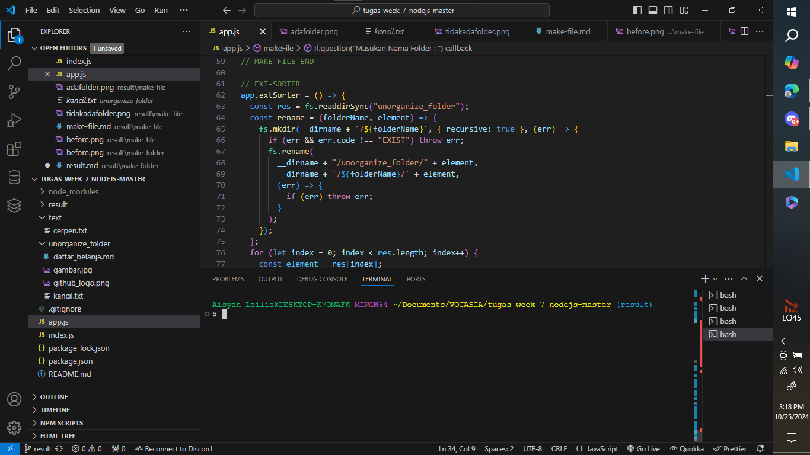
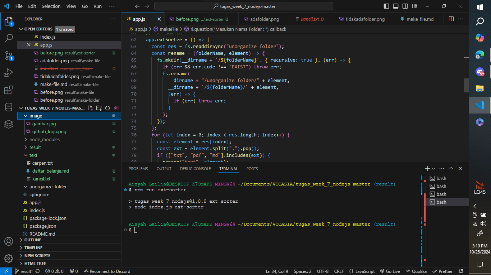

# Fitur `ext-sorter` (EXT-SORTER)

Fitur `ext-sorter` digunakan untuk mengelompokkan file yang ada di dalam folder `unorganize_folder` ke dalam folder yang sesuai berdasarkan ekstensi file. File akan dipindahkan ke dalam folder `text`, `image`, atau `unknown` sesuai dengan jenis file-nya. Fitur ini menggunakan Node.js dan modul `fs`.

---

## Implementasi Kode

Berikut adalah kode yang digunakan dalam fungsi `ext-sorter`:

```javascript
app.extSorter = () => {
  const res = fs.readdirSync("unorganize_folder");
  const rename = (folderName, element) => {
    fs.mkdir(__dirname + `/${folderName}`, { recursive: true }, (err) => {
      if (err && err.code !== "EEXIST") throw err;
      fs.rename(
        __dirname + "/unorganize_folder/" + element,
        __dirname + `/${folderName}/` + element,
        (err) => {
          if (err) throw err;
        }
      );
    });
  };

  for (let index = 0; index < res.length; index++) {
    const element = res[index];
    const ext = element.split(".").pop();
    if (["txt", "pdf", "md"].includes(ext)) {
      rename("text", element);
    } else if (["jpg", "png"].includes(ext)) {
      rename("image", element);
    } else {
      rename("unknown", element);
    }
  }
  rl.close();
};
```

## Cara Menggunakan

1. Jalankan perintah berikut untuk menjalankan fungsi ext-sorter:

```bash
npm run ext-sorter
```

3. Masukkan nama folder yang ingin Anda buat ketika diminta.

## Output

Berikut adalah contoh hasil ketika fungsi `ext-sorter` berhasil dijalankan :



menjadi (file sudah tersortir di masing masing folder => image, text)



## Struktur Project

```bash
TUGAS_WEEK_7_NODEJS-MASTER/
│
├── app.js                  # File utama untuk logika aplikasi
├── index.js                # File entry point aplikasi
├── unorganize_folder/      # Folder berisi file yang belum terorganisir
├── result/                 # Folder berisi screenshot hasil output
├── image/                  # Folder berisi file yang berextensi png/jpg
│   └── gambar.png
│   └── github_logo.png
├── text/                  # Folder berisi file yang berextensi pdf/txt/md
│   └── cerpen.txt
│   └── kancil.txt
│   └── daftar_belanja.md
├── README.md               # Dokumentasi project
└── package.json            # File konfigurasi npm
```
