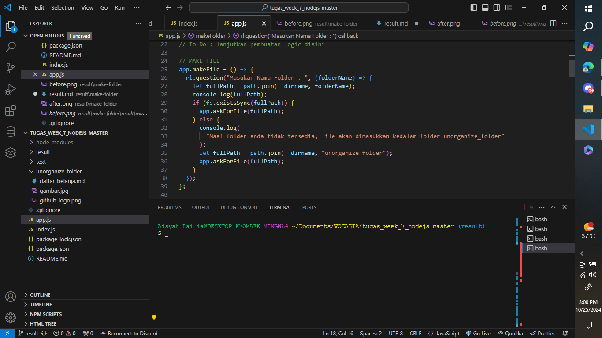
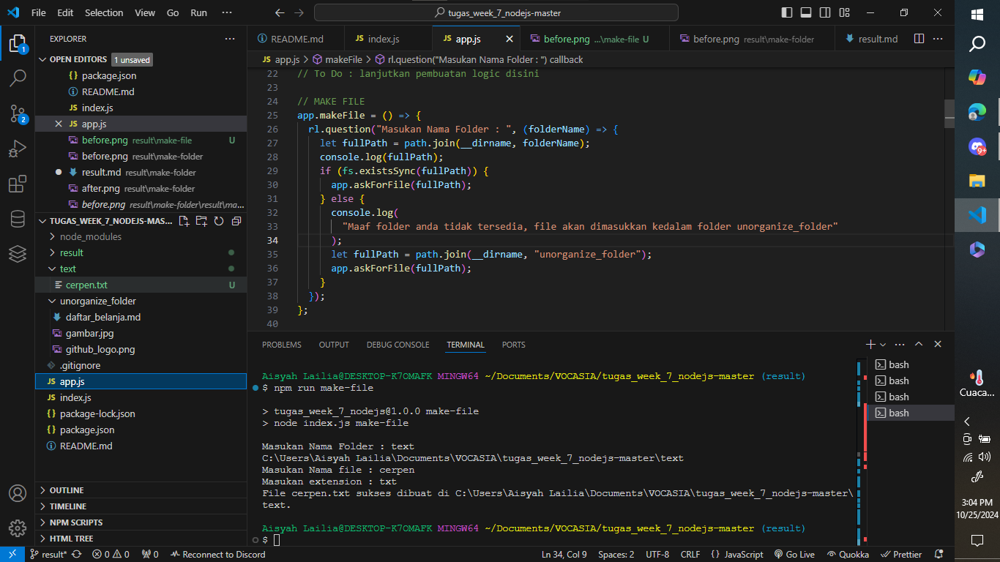
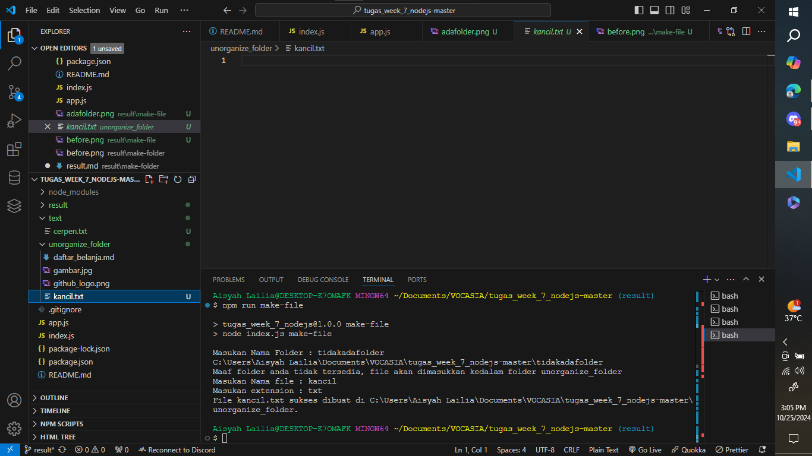

# Fitur `make-file`

Fitur `make-file` digunakan untuk membuat file baru di dalam folder yang ditentukan oleh pengguna. Jika folder tidak ada, file akan dibuat di dalam folder `unorganize_folder`. Fitur ini menggunakan Node.js dan modul `fs` serta `path`.

---

## Implementasi Kode

Berikut adalah kode yang digunakan dalam fungsi `makeFile` dan `askForFile`:

```javascript
app.makeFile = () => {
  rl.question("Masukan Nama Folder : ", (folderName) => {
    let fullPath = path.join(__dirname, folderName);
    console.log(fullPath);
    if (fs.existsSync(fullPath)) {
      app.askForFile(fullPath);
    } else {
      console.log(
        "Maaf folder anda tidak tersedia, file akan dimasukkan kedalam folder unorganize_folder"
      );
      let fullPath = path.join(__dirname, "unorganize_folder");
      app.askForFile(fullPath);
    }
  });
};

app.askForFile = (folderPath) => {
  rl.question("Masukan Nama file : ", (file) => {
    rl.question("Masukan extension : ", (ext) => {
      const files = fs
        .readdirSync(folderPath)
        .filter((item) => item === `${file}.${ext}`);

      if (files.length > 0) {
        console.log("Nama file sudah ada, mohon ganti nama file");
        askForFile(folderPath);
      } else {
        fs.writeFileSync(path.join(folderPath, `${file}.${ext}`), "");
        console.log(`File ${file}.${ext} sukses dibuat di ${folderPath}.`);
        rl.close();
      }
    });
  });
};
```

## Cara Menggunakan

1. Pastikan berada di dalam branch result untuk menyimpan output (bukti screenshot).
2. Jalankan perintah berikut untuk menjalankan fungsi make-file:

```bash
npm run make-file
```

3. Masukkan nama folder, nama file, dan ekstensi file yang ingin Anda buat ketika diminta.

## Output

Berikut adalah contoh hasil ketika fungsi `make-file` berhasil dijalankan:

sebelum di run :


Dalam contoh ini, pengguna memasukkan nama folder, nama file, dan ekstensi, jika folder yang diinput **sudah pernah dibuat** maka file akan masuk kedalam folder yang diinputkan. seperti berikut :


jika **belum pernah dibuat** maka file akan masuk kedalam folder `unorganize_folder`:

