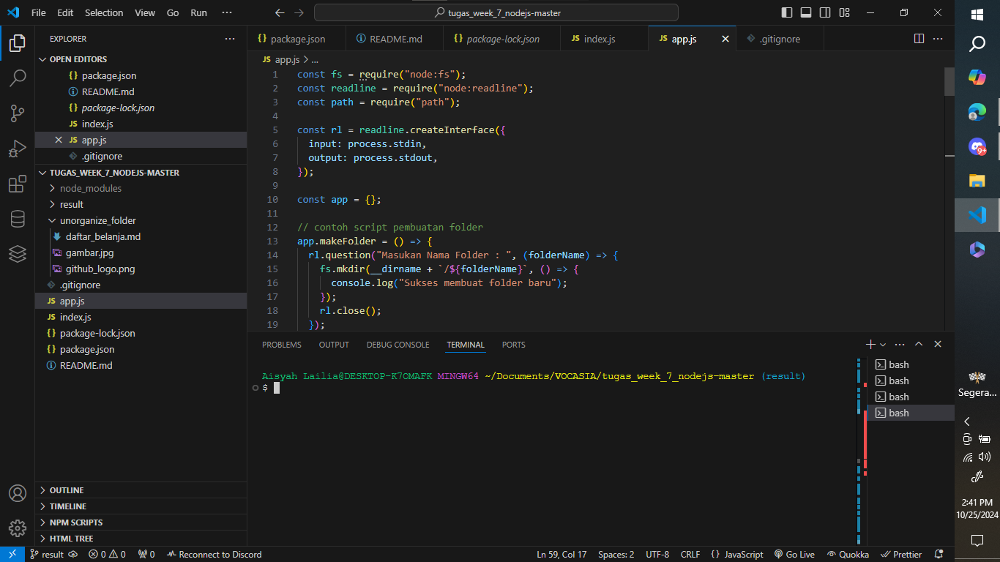
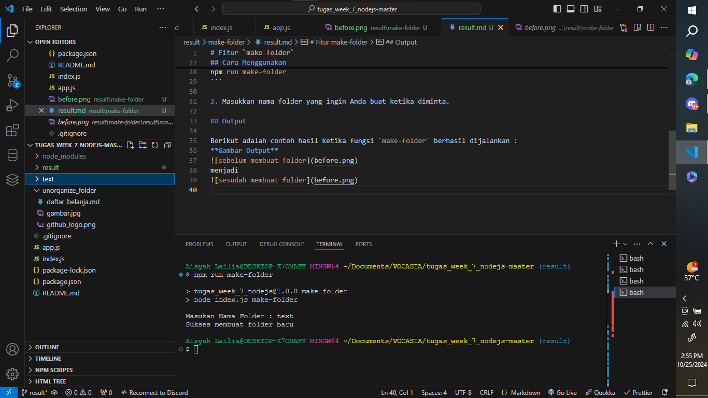

# Fitur `make-folder`

Fitur `make-folder` digunakan untuk membuat folder baru berdasarkan nama yang diinputkan pengguna. Fitur ini menggunakan Node.js dan modul `fs` untuk membuat direktori baru.

---

## Implementasi Kode

Berikut adalah kode yang digunakan dalam fungsi `makeFolder`:

```javascript
app.makeFolder = () => {
  rl.question("Masukan Nama Folder : ", (folderName) => {
    fs.mkdir(__dirname + `/${folderName}`, () => {
      console.log("Sukses membuat folder baru");
    });
    rl.close();
  });
};
```

## Cara Menggunakan

1. Jalankan perintah berikut untuk menjalankan fungsi make-folder:

```bash
npm run make-folder
```

3. Masukkan nama folder yang ingin Anda buat ketika diminta.

## Output

Berikut adalah contoh hasil ketika fungsi `make-folder` berhasil dijalankan :


menjadi

