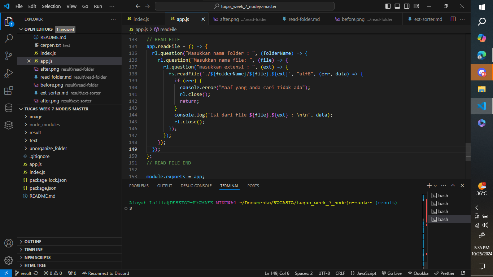
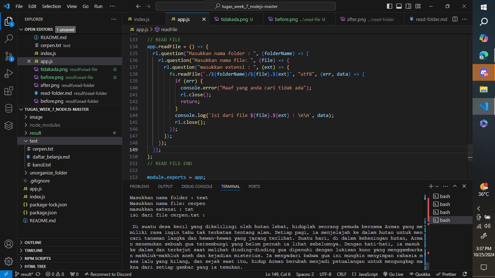
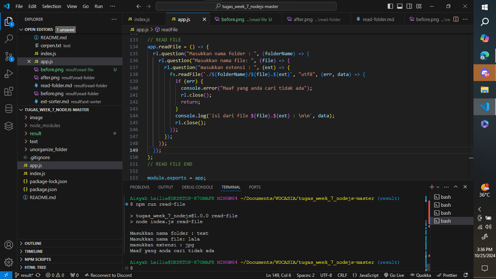

# Fitur `readFile` (READ FILE)

Fitur `readFile` digunakan untuk membaca isi file tertentu berdasarkan nama folder, nama file, dan ekstensi yang diberikan oleh pengguna. Fitur ini menggunakan Node.js dan modul `fs`.

---

## Implementasi Kode

Berikut adalah kode yang digunakan dalam fungsi `readFile`:

```javascript
app.readFile = () => {
  rl.question("Masukkan nama folder : ", (folderName) => {
    rl.question("Masukkan nama file: ", (file) => {
      rl.question("Masukkan ekstensi : ", (ext) => {
        fs.readFile(`./${folderName}/${file}.${ext}`, "utf8", (err, data) => {
          if (err) {
            console.error("Maaf yang anda cari tidak ada");
            rl.close();
            return;
          }
          console.log(`Isi dari file ${file}.${ext} : \n\n`, data);
          rl.close();
        });
      });
    });
  });
};
```

## Cara Menggunakan

1. Jalankan perintah berikut untuk menjalankan fungsi read-file:

```bash
npm run read-file
```

3. Masukkan nama folder, nama file, dan ekstensi file yang ingin Anda buat ketika diminta.

## Output

Berikut adalah contoh hasil ketika fungsi `read-file` berhasil dijalankan:

sebelum di run :


Dalam contoh ini, pengguna memasukkan nama folder, nama file, dan ekstensi, jika folder, file, dan ekstensi yang diinputkan benar, dan pernah dibuat maka program akan menampilkan isi file :


jika **belum pernah dibuat** maka file akan memberi pemberitahuan bahwa `file yang anda cari tidak ada`:

