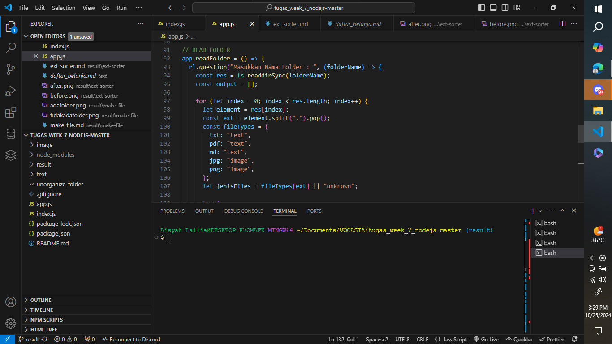
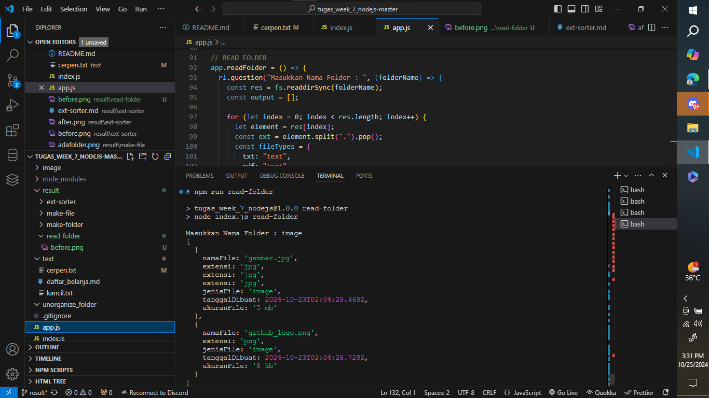

# Fitur `readFolder` (READ FOLDER)

Fitur `readFolder` digunakan untuk membaca isi folder dan menampilkan informasi detail mengenai file yang ada di dalamnya. Informasi yang ditampilkan mencakup nama file, ekstensi, jenis file, tanggal dibuat, dan ukuran file. Fitur ini menggunakan Node.js dan modul `fs`.

---

## Implementasi Kode

Berikut adalah kode yang digunakan dalam fungsi `readFolder`:

```javascript
app.readFolder = () => {
  rl.question("Masukkan Nama Folder : ", (folderName) => {
    const res = fs.readdirSync(folderName);
    const output = [];

    for (let index = 0; index < res.length; index++) {
      let element = res[index];
      const ext = element.split(".").pop();
      const fileTypes = {
        txt: "text",
        pdf: "text",
        md: "text",
        jpg: "image",
        png: "image",
      };
      let jenisFiles = fileTypes[ext] || "unknown";

      try {
        const stat = fs.statSync(__dirname + `/${folderName}` + "/" + element);
        let result =
          stat.size > 1048576
            ? parseInt(stat.size / 1048576) + " mb"
            : parseInt(stat.size / 1024) + " kb";
        output.push({
          namaFile: element,
          extensi: element.split(".")[element.split(".").length - 1],
          jenisFile: jenisFiles,
          tanggalDibuat: stat.birthtime,
          ukuranFile: result,
        });
      } catch (err) {
        console.log("Gagal membaca file", folderName, element);
      } finally {
        rl.close();
      }
    }
    console.log(output);
  });
};
```

## Cara Menggunakan

1. Pastikan berada di dalam branch result untuk menyimpan output (bukti screenshot).
2. Jalankan perintah berikut untuk menjalankan fungsi read-folder:

```bash
npm run read-folder
```

3. Masukkan nama folder yang ingin Anda buat ketika diminta.

## Output

Berikut adalah contoh hasil ketika fungsi `read-folder` berhasil dijalankan :



menampilkan hasil read folder


